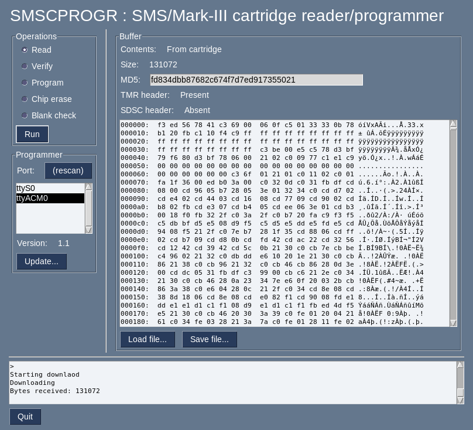

# SMSCPROGR : SMS/Mark-III cartridge reader/programmer

## Overview

This repository contains the firmware source code for a master system game
cartridge reader and programmer.

For more information about this, and use examples and instructions, please
visit the project page:

* [Project page (english)](https://www.raphnet.net/electronique/sms_cartridge_programmer/index_en.php)
* [Project page (french)](https://www.raphnet.net/electronique/sms_cartridge_programmer/index.php)

Current features are:
* Cartridge ROM dumping
* Flash cartridge programming
* Auto-detects ROM size
* Supported cartriges:
  * Supports SMS 50 pin cartridges
  * SMS 44 pin (Japan) /Mark-III cartriges
  * SG-1000 Cartridges
  * Sega Cards (through a card catcher)
  * Game Gear (using an appropriate adapter)

## Compilation

### AVR firmware

On a Linux or Unit system, with make, gcc-avr and avr-libc installed and in your path, it should be
a simple matter of typing "make".

You will also need dfu-programmer to program the micro-controller. If you have the correct permissions
set in udev, you should be able to type "make flash" to program the micro-controller for the first time.

If you are reprogramming or upgrading, you must enter bootloader mode first by using the "boot" command
in the virtual com port.

### CPLD

You will need WinCUPL, which is at this date (2021-02) available for free from
microchip here:

[WinCUPL](https://www.microchip.com/en-us/products/fpgas-and-plds/spld-cplds/pld-design-resources)

I could not get the GUI to work reliably on my system (it kept crashing,
especially in simulation) so instead I use batch files. But it's probably
better like this anyway.

Run setup.bat once (optionally edit it first if the paths are different on your system), then run compile.bat to compile and generate a new .JED file and use the ATMISP tool to program the CPLD.

## Use

## Option 1: Using the python gui

There is now a user interface based on FreeSimpleGUI. At the moment it is only distributed in source code format,
but eventually I plan to use pyinstaller to make something easier. Dependencies are:

 * FreeSimpleGUI
 * python3-serial
 * xmodem

## Option 2: Command-line python client

The client/ directory contains a python tool which opens the device (ttyACMx) and types commands for you. If
you are producing a large batch of cartridges, this is recommended as it is much faster (less typing!), and can
be more convenient than using the GUI 

The following python packages are required:

 * python3-serial
 * xmodem
 * PySimpleGUI

## Option 3: Using a communication program

The cartridge reader/programmer can be controlled using your favorite serial terminal software. For instance,
under Linux the programmer should appear as /dev/ttyACMx and you can simply fire minicom -D /dev/ttyACMx 
and type ? followed by enter to get a list of available commands.

ROMs can be dumped or programmed (supported Flash cartridge only) using XModem transfers.

For examples, please visit the project homepage.

##  Authors

* **Raphael Assenat**

## Licence

GPL. See LICENSE for more information.
